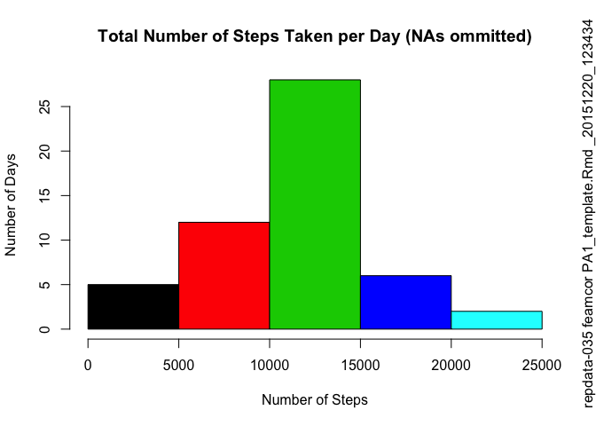
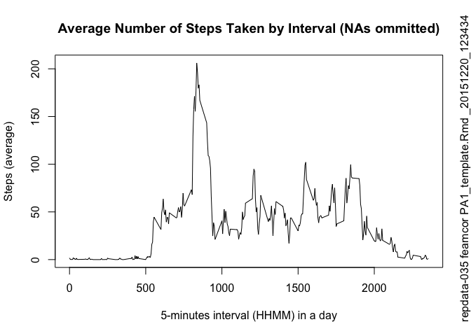
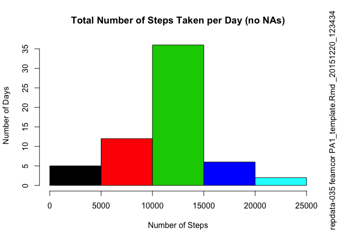
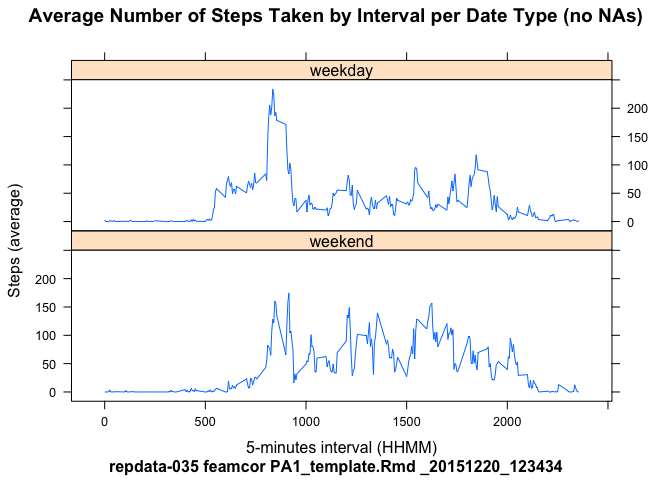

# Reproducible Research: Peer Assessment 1
Fabio Correa (@feamcor, coursera, data science specialization, repdata-035)  
December 2015  


## Loading the Dataset

```r
# if dataset zip file does not exist, download it
filename.zip <- "activity.zip"
if(!file.exists(filename.zip)) {
    dataset.url <- "https://d396qusza40orc.cloudfront.net/repdata%2Fdata%2Factivity.zip"
    download.file(url = dataset.url, destfile = filename.zip, method = "auto")
    message(paste(Sys.time(), "Dataset zip file downloaded!", filename.zip))
} else {
    message(paste(Sys.time(), "Dataset zip file already exists!", filename.zip))
}
```

```
## 2015-12-20 12:34:35 Dataset zip file downloaded! activity.zip
```

```r
# if dataset csv file does not exist, get it from zip file
filename.csv <- "activity.csv"
if(!file.exists(filename.csv)) {
    unzip(filename.zip, overwrite = TRUE)
    message(paste(Sys.time(), "Dataset file expanded!", filename.csv))
} else {
    message(paste(Sys.time(), "Dataset file already exists!", filename.csv))
}
```

```
## 2015-12-20 12:34:35 Dataset file expanded! activity.csv
```

```r
# read dataset csv file
dataset <- read.csv(filename.csv,
                    header=TRUE,
                    colClasses=c("integer", "Date", "integer"))
str(dataset)
```

```
## 'data.frame':	17568 obs. of  3 variables:
##  $ steps   : int  NA NA NA NA NA NA NA NA NA NA ...
##  $ date    : Date, format: "2012-10-01" "2012-10-01" ...
##  $ interval: int  0 5 10 15 20 25 30 35 40 45 ...
```

```r
head(dataset)
```

```
##   steps       date interval
## 1    NA 2012-10-01        0
## 2    NA 2012-10-01        5
## 3    NA 2012-10-01       10
## 4    NA 2012-10-01       15
## 5    NA 2012-10-01       20
## 6    NA 2012-10-01       25
```

```r
summary(dataset)
```

```
##      steps             date               interval     
##  Min.   :  0.00   Min.   :2012-10-01   Min.   :   0.0  
##  1st Qu.:  0.00   1st Qu.:2012-10-16   1st Qu.: 588.8  
##  Median :  0.00   Median :2012-10-31   Median :1177.5  
##  Mean   : 37.38   Mean   :2012-10-31   Mean   :1177.5  
##  3rd Qu.: 12.00   3rd Qu.:2012-11-15   3rd Qu.:1766.2  
##  Max.   :806.00   Max.   :2012-11-30   Max.   :2355.0  
##  NA's   :2304
```
The dataset contains __17568__ observations!  
The variables included in the dataset are:

*  __steps__: Number of steps taken in a 5-minute interval (missing values are coded as NA)
*  __date__: The date on which the measurement was taken (YYYY-MM-DD)
*  __interval__: Identifier for the 5-minute interval in which measurement was taken

## Pre-processing the Dataset

```r
# create factor to indicate if date is of type weekday or weekend
weekend <- c("Sat", "Sun")
date.type <- factor(weekdays(dataset$date,
                             abbreviate = TRUE) %in% weekend,
                    levels = c(TRUE, FALSE),
                    labels = c('weekend', 'weekday'))
# bind new calculated factor to the original dataset
dataset <- cbind(dataset, date.type)
str(dataset)
```

```
## 'data.frame':	17568 obs. of  4 variables:
##  $ steps    : int  NA NA NA NA NA NA NA NA NA NA ...
##  $ date     : Date, format: "2012-10-01" "2012-10-01" ...
##  $ interval : int  0 5 10 15 20 25 30 35 40 45 ...
##  $ date.type: Factor w/ 2 levels "weekend","weekday": 2 2 2 2 2 2 2 2 2 2 ...
```

```r
head(dataset)
```

```
##   steps       date interval date.type
## 1    NA 2012-10-01        0   weekday
## 2    NA 2012-10-01        5   weekday
## 3    NA 2012-10-01       10   weekday
## 4    NA 2012-10-01       15   weekday
## 5    NA 2012-10-01       20   weekday
## 6    NA 2012-10-01       25   weekday
```

```r
summary(dataset)
```

```
##      steps             date               interval        date.type    
##  Min.   :  0.00   Min.   :2012-10-01   Min.   :   0.0   weekend: 4608  
##  1st Qu.:  0.00   1st Qu.:2012-10-16   1st Qu.: 588.8   weekday:12960  
##  Median :  0.00   Median :2012-10-31   Median :1177.5                  
##  Mean   : 37.38   Mean   :2012-10-31   Mean   :1177.5                  
##  3rd Qu.: 12.00   3rd Qu.:2012-11-15   3rd Qu.:1766.2                  
##  Max.   :806.00   Max.   :2012-11-30   Max.   :2355.0                  
##  NA's   :2304
```
New column __date.type__ added to dataset indicating whether date is __weekday__ or __weekend__.

## Average Total Number of Steps Taken per Day

```r
# calculate total of steps taken by individual per day
stepsday <- aggregate(steps ~ date, data = dataset, FUN = sum)
str(stepsday)
```

```
## 'data.frame':	53 obs. of  2 variables:
##  $ date : Date, format: "2012-10-02" "2012-10-03" ...
##  $ steps: int  126 11352 12116 13294 15420 11015 12811 9900 10304 17382 ...
```

```r
head(stepsday)
```

```
##         date steps
## 1 2012-10-02   126
## 2 2012-10-03 11352
## 3 2012-10-04 12116
## 4 2012-10-05 13294
## 5 2012-10-06 15420
## 6 2012-10-07 11015
```

```r
summary(stepsday)
```

```
##       date                steps      
##  Min.   :2012-10-02   Min.   :   41  
##  1st Qu.:2012-10-16   1st Qu.: 8841  
##  Median :2012-10-29   Median :10765  
##  Mean   :2012-10-30   Mean   :10766  
##  3rd Qu.:2012-11-16   3rd Qu.:13294  
##  Max.   :2012-11-29   Max.   :21194
```

```r
# plot its histogram
hist(stepsday$steps,
     freq=TRUE,
     plot=TRUE,
     main="Total Number of Steps Taken per Day (NAs ommitted)",
     xlab="Number of Steps",
     ylab="Number of Days",
     col=palette("default"))
# add evidence in the plot that it was generated by this script
par(oma=c(0,0,0,1), cex.sub=0.25)
mtext(paste("repdata-035 feamcor", script.name, start.time.text), side=4, outer=TRUE)
```

 

```r
# calculate mean and median
stepsday.mean <- mean(stepsday$steps)
stepsday.median <- median(stepsday$steps)
```
Individual took an average (mean) of __10766__ steps per day.  
The median was a day where individual took __10765__ steps.

## Average Daily Activity Pattern

```r
# calculate average of steps taken by individual per interval
avgpattern <- aggregate(steps ~ interval, data = dataset, FUN = mean)
str(avgpattern)
```

```
## 'data.frame':	288 obs. of  2 variables:
##  $ interval: int  0 5 10 15 20 25 30 35 40 45 ...
##  $ steps   : num  1.717 0.3396 0.1321 0.1509 0.0755 ...
```

```r
head(avgpattern)
```

```
##   interval     steps
## 1        0 1.7169811
## 2        5 0.3396226
## 3       10 0.1320755
## 4       15 0.1509434
## 5       20 0.0754717
## 6       25 2.0943396
```

```r
summary(avgpattern)
```

```
##     interval          steps        
##  Min.   :   0.0   Min.   :  0.000  
##  1st Qu.: 588.8   1st Qu.:  2.486  
##  Median :1177.5   Median : 34.113  
##  Mean   :1177.5   Mean   : 37.383  
##  3rd Qu.:1766.2   3rd Qu.: 52.835  
##  Max.   :2355.0   Max.   :206.170
```

```r
# plot its timeseries
plot(avgpattern$interval,
     avgpattern$steps,
     type="l",
     main="Average Number of Steps Taken by Interval (NAs ommitted)",
     xlab="5-minutes interval (HHMM) in a day",
     ylab="Steps (average)")
# add evidence in the plot that it was generated by this script
par(oma=c(0,0,0,1), cex.sub=0.25)
mtext(paste("repdata-035 feamcor", script.name, start.time.text), side=4, outer=TRUE)
```

 

```r
# find interval with maximum number of steps
max.row <- which.max(avgpattern$steps)
max.interval <- avgpattern[max.row, "interval"]
max.steps <- avgpattern[max.row, "steps"]
```
Individual most active 5-minute interval was at __0835__ with an average of __206__ steps taken.

## Missing Values in the Dataset

```r
# calculate total number of missing values in the dataset
steps.NA <- sum(is.na(dataset$steps))
# calculate average of steps taken by individual per interval and date type
filler <- aggregate(steps ~ interval + date.type, data = dataset, FUN = mean)
str(filler)
```

```
## 'data.frame':	576 obs. of  3 variables:
##  $ interval : int  0 5 10 15 20 25 30 35 40 45 ...
##  $ date.type: Factor w/ 2 levels "weekend","weekday": 1 1 1 1 1 1 1 1 1 1 ...
##  $ steps    : num  0 0 0 0 0 ...
```

```r
head(filler)
```

```
##   interval date.type    steps
## 1        0   weekend 0.000000
## 2        5   weekend 0.000000
## 3       10   weekend 0.000000
## 4       15   weekend 0.000000
## 5       20   weekend 0.000000
## 6       25   weekend 3.714286
```

```r
summary(filler)
```

```
##     interval        date.type       steps        
##  Min.   :   0.0   weekend:288   Min.   :  0.000  
##  1st Qu.: 588.8   weekday:288   1st Qu.:  1.854  
##  Median :1177.5                 Median : 26.295  
##  Mean   :1177.5                 Mean   : 39.208  
##  3rd Qu.:1766.2                 3rd Qu.: 62.321  
##  Max.   :2355.0                 Max.   :234.103
```

```r
# create new dataset by merging data frames
dataset.noNA <- merge(dataset, filler, by = c("interval", "date.type"), all.x = TRUE)
str(dataset.noNA)
```

```
## 'data.frame':	17568 obs. of  5 variables:
##  $ interval : int  0 0 0 0 0 0 0 0 0 0 ...
##  $ date.type: Factor w/ 2 levels "weekend","weekday": 2 2 2 2 2 2 2 2 2 2 ...
##  $ steps.x  : int  NA 0 34 0 0 0 0 0 0 0 ...
##  $ date     : Date, format: "2012-10-01" "2012-11-23" ...
##  $ steps.y  : num  2.33 2.33 2.33 2.33 2.33 ...
```

```r
head(dataset.noNA)
```

```
##   interval date.type steps.x       date  steps.y
## 1        0   weekday      NA 2012-10-01 2.333333
## 2        0   weekday       0 2012-11-23 2.333333
## 3        0   weekday      34 2012-10-10 2.333333
## 4        0   weekday       0 2012-11-06 2.333333
## 5        0   weekday       0 2012-10-31 2.333333
## 6        0   weekday       0 2012-11-15 2.333333
```

```r
# fill the missing values in order to be able to derive plot based on one column only (steps.x)
dataset.noNA$steps.x[is.na(dataset.noNA$steps.x)] <- dataset.noNA$steps.y[is.na(dataset.noNA$steps.x)]
head(dataset.noNA)
```

```
##   interval date.type   steps.x       date  steps.y
## 1        0   weekday  2.333333 2012-10-01 2.333333
## 2        0   weekday  0.000000 2012-11-23 2.333333
## 3        0   weekday 34.000000 2012-10-10 2.333333
## 4        0   weekday  0.000000 2012-11-06 2.333333
## 5        0   weekday  0.000000 2012-10-31 2.333333
## 6        0   weekday  0.000000 2012-11-15 2.333333
```

```r
summary(dataset.noNA)
```

```
##     interval        date.type        steps.x            date           
##  Min.   :   0.0   weekend: 4608   Min.   :  0.00   Min.   :2012-10-01  
##  1st Qu.: 588.8   weekday:12960   1st Qu.:  0.00   1st Qu.:2012-10-16  
##  Median :1177.5                   Median :  0.00   Median :2012-10-31  
##  Mean   :1177.5                   Mean   : 37.37   Mean   :2012-10-31  
##  3rd Qu.:1766.2                   3rd Qu.: 24.00   3rd Qu.:2012-11-15  
##  Max.   :2355.0                   Max.   :806.00   Max.   :2012-11-30  
##     steps.y       
##  Min.   :  0.000  
##  1st Qu.:  2.103  
##  Median : 24.769  
##  Mean   : 37.368  
##  3rd Qu.: 57.333  
##  Max.   :234.103
```

```r
# calculate total of steps taken by individual per day
stepsday.noNA <- aggregate(steps.x ~ date, data = dataset.noNA, FUN = sum)
head(stepsday.noNA)
```

```
##         date  steps.x
## 1 2012-10-01 10177.33
## 2 2012-10-02   126.00
## 3 2012-10-03 11352.00
## 4 2012-10-04 12116.00
## 5 2012-10-05 13294.00
## 6 2012-10-06 15420.00
```

```r
summary(stepsday.noNA)
```

```
##       date               steps.x     
##  Min.   :2012-10-01   Min.   :   41  
##  1st Qu.:2012-10-16   1st Qu.: 9819  
##  Median :2012-10-31   Median :10571  
##  Mean   :2012-10-31   Mean   :10762  
##  3rd Qu.:2012-11-15   3rd Qu.:12811  
##  Max.   :2012-11-30   Max.   :21194
```

```r
# plot its histogram
hist(stepsday.noNA$steps.x,
     freq=TRUE,
     plot=TRUE,
     main="Total Number of Steps Taken per Day (no NAs)",
     xlab="Number of Steps",
     ylab="Number of Days",
     col=palette("default"))
# add evidence in the plot that it was generated by this script
par(oma=c(0,0,0,1), cex.sub=0.25)
mtext(paste("repdata-035 feamcor", script.name, start.time.text), side=4, outer=TRUE)
```

 

```r
# calculate mean and median
stepsday.noNA.mean <- mean(stepsday.noNA$steps)
stepsday.noNA.median <- median(stepsday.noNA$steps)
```
There are __2304__ rows in the dataset with missing values for the __steps__ variable.  
These variables were filled with the average of steps within the 5-minute interval according to the date type (weekday or weekend).  
Based on these changes:  

* Individual took an average (mean) of __10762__ steps per day.  
* The median was a day where individual took __10571__ steps.

## Differences in Activity Patterns

```r
# calculate average of steps by individual per interval
diffpattern <- aggregate(steps.x ~ interval + date.type, data = dataset.noNA, FUN = mean)
str(diffpattern)
```

```
## 'data.frame':	576 obs. of  3 variables:
##  $ interval : int  0 5 10 15 20 25 30 35 40 45 ...
##  $ date.type: Factor w/ 2 levels "weekend","weekday": 1 1 1 1 1 1 1 1 1 1 ...
##  $ steps.x  : num  0 0 0 0 0 ...
```

```r
head(diffpattern)
```

```
##   interval date.type  steps.x
## 1        0   weekend 0.000000
## 2        5   weekend 0.000000
## 3       10   weekend 0.000000
## 4       15   weekend 0.000000
## 5       20   weekend 0.000000
## 6       25   weekend 3.714286
```

```r
# plot timeseries
xyplot(steps.x ~ interval | date.type,
       data=diffpattern,
       layout=c(1,2),
       type="l",
       xlab="5-minutes interval (HHMM)",
       ylab="Steps (average)",
       main="Average Number of Steps Taken by Interval per Date Type (no NAs)",
       sub=paste("repdata-035 feamcor", script.name, start.time.text))
```

 
---
By [feamcor](https://github.com/feamcor).
